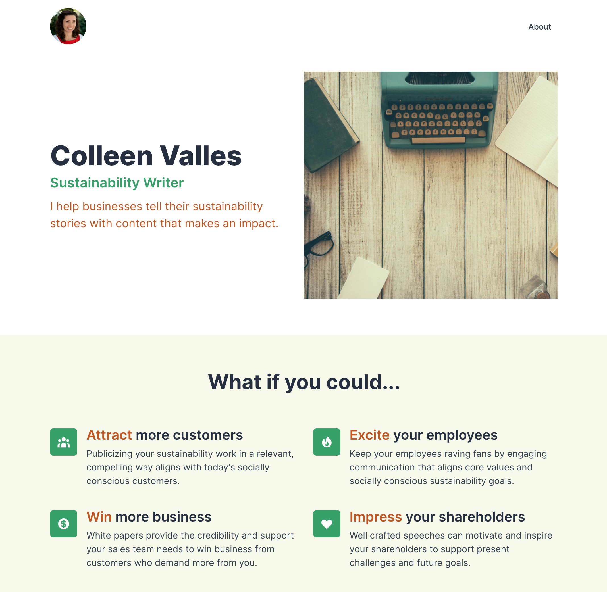

# cv-ui

UI concept for my sister's website. ([demo](https://www.dtjv.io/cv-ui/))



## Development

`$ yarn install`

```sh
# in terminal 1
$ yarn watch:pug

# in terminal 2
$ yarn watch:css

# in terminal 3
$ yarn start
```

## Notes

`dist/` is included in repo because I keep static assets there.

## License

The source code is available under the [MIT license](LICENSE).
